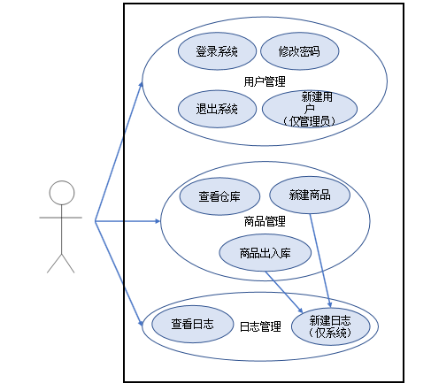
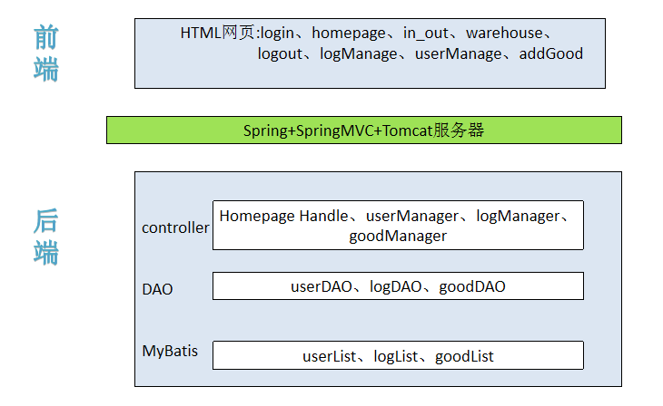
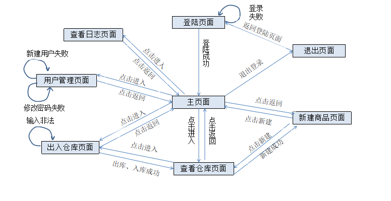
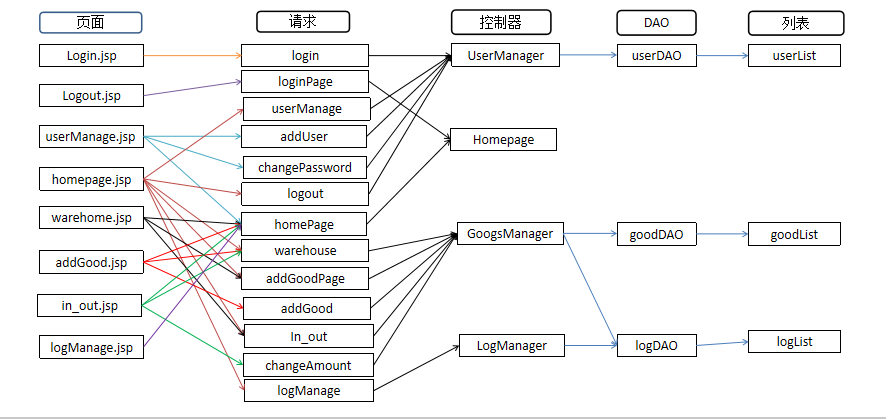

# 超市仓库管理系统 By Shaun and Arthur.  
基于SSM（Spring+SpringMVC+Java List，无数据库）开发的超市仓库管理系统，小巧精悍，界面做了美工，各种排错处理都有，能满足普通的本科毕业设计要求。  
后端源代码均在src文件夹内，前段网页代码均在web-content文件夹内，各种使用到的库已经包含在里面了。
## 我的博客网站 https://yiweifengyan.home.blog/  
## 主要内容
 - [系统用例图](https://github.com/yiweifengyan/Warehouse_Management_System/blob/master/README.md#系统用例)	
 - [系统架构图](https://github.com/yiweifengyan/Warehouse_Management_System/blob/master/README.md#系统架构)	
 - [实体关系图](https://github.com/yiweifengyan/Warehouse_Management_System/blob/master/README.md#实体关系图)
 - [页面关系图](https://github.com/yiweifengyan/Warehouse_Management_System/blob/master/README.md#页面关系图)
 - [请求映射图](https://github.com/yiweifengyan/Warehouse_Management_System/blob/master/README.md#系统详细请求映射图)
 - [原测试环境](https://github.com/yiweifengyan/Warehouse_Management_System/blob/master/README.md#原系统测试环境)
## 系统用例图

## 系统架构图

## 实体关系图

## 页面关系图

## 系统详细请求映射图

## 原系统测试环境
Windows 7 & 10  
Eclipse Java EE IDE 2019-03  
JDK 8u212 64-bit  
**请在Eclipse内下载Tomcat 6.0和Spring Tool Suite (STS) 3.9.9**  
