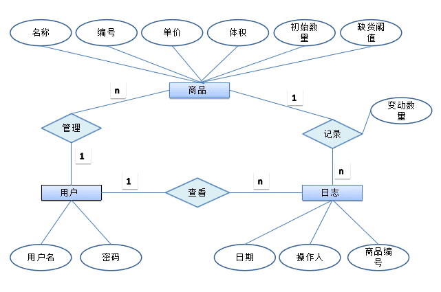

# 超市仓库管理系统
A warehouse management system developed using SSM by Shaun and Arthur.
## 主要工作
 - 软件定义	为了解决什么问题，面对哪些用户，开发的什么样的软件
 - 功能分析	软件需要具备哪些功能，对它有什么样的要求，需要有条理的详细列出
 - 使用案例	使用此软件的所有功能，完成各项任务时，用户与软件内部的操作流程
 - 界面设计	软件界面应该长什么样子，在完成各种操作时，系统展示的界面
 - 类的设计	软件内部应该有哪些类，每个类具备哪些变量和函数，完成什么功能
 - 类的流图	对于每个系统案例，每个类之间需要进行哪些通讯，传输什么变量
 - 系统架构	系统分为哪些部分，它们如何组合在一起工作，是一张高层的抽象的图
 - 环境搭建	开发环境搭建，使用哪些编程语言，使用哪些库
 - 代码编写	写代码实现所要求的功能
 - 系统测试	通过各种测试，验证系统符合要求
## 系统用例
!(image/ware-usecase.png)
## 系统架构

## 实体关系图
!(image/ware-er.png)
## 系统详细请求映射图
!(image/ware-request.png)
## 原系统测试环境
Windows 7 & 10
Eclipse Java EE IDE 2019-03 
JDK 8u212 64-bit
**请在Eclipse内下载Tomcat 6.0和Spring Tool Suite (STS) 3.9.9**
